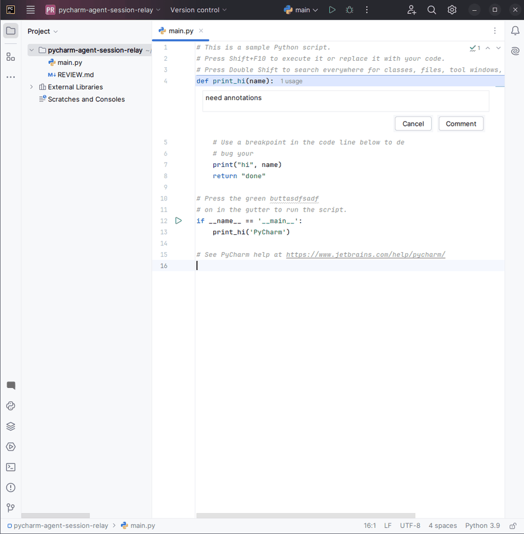

# &nbsp; Agent Session Relay

A JetBrains/PyCharm plugin — **Relay** for short — that lets you review the agent's changes
in your IDE and relay batched, line-anchored comments straight into its running session.

Relay is a **two-way channel** between you and an agent CLI (Claude Code, Codex, or any
agent): the terminal carries **agent → you**, and a batched, line-anchored **review surface**
carries **you → agent** — relayed into the specific session that made the changes.

[](https://plugins.jetbrains.com/plugin/32797-agent-session-relay)
[](https://plugins.jetbrains.com/plugin/32797-agent-session-relay)
[](https://github.com/zerlok/pycharm-agent-session-relay/actions/workflows/ci.yml)
[](LICENSE)



> **Status: MVP implemented.** The full annotate → batch → export → deliver loop works (see
> [`docs/ARCHITECTURE.md`](docs/ARCHITECTURE.md) for the design). Persistence across restarts, typed
> terminal relay, and multi-session/worktree support remain deferred follow-ons.

## Install

**[Agent Session Relay on the JetBrains Marketplace →](https://plugins.jetbrains.com/plugin/32797-agent-session-relay)**

In your IDE: **Settings → Plugins → Marketplace**, search **"Agent Session Relay"**, then **Install**.
Requires a **2024.2 or newer** IntelliJ-based IDE — built for PyCharm Community, runs in any
IntelliJ-based IDE.

## The problem

When an agent edits your files remotely and they sync back locally, PyCharm shows you the
diff — but there's no way to attach several line-anchored comments and return them to the
agent as one reviewable batch. You end up retyping feedback into the terminal, losing the
file/line anchoring the agent could otherwise resolve directly.

## What Relay does

Relay is a **line-anchored annotation layer over any file in the project**, batched and
exported to an agent CLI. The canonical flow:

```
 0. agent edits files  →  they land in your local working tree (synced in, if remote)
 1. Refresh & review  →  VFS refresh so the edits on disk show up
 2. open a file, select lines, leave a comment  (repeat across files)
 3. see / edit / delete pending comments  (inline cards + tool window)
 4. open the tool window, preview the batch, add more
 5. (the agent sits idle, waiting for input)
 6. press Submit  →  Relay writes REVIEW.md at the project root and notifies you to hand it to the agent
```

The export uses Claude Code's native reference syntax (`@path/file.py#L10-15` + comment
body), so the agent resolves anchors directly — no in-file comment markers that would
collide with the agent's own edits under bidirectional sync.

## Launch & observe agent sessions

Relay also **launches agent sessions from the IDE and shows them live** — agent-agnostic
(Claude Code, Codex, or any harness), local or remote. You author a **start script** in
**Settings → Tools → Agent Session Relay**; launching it opens a terminal in a dedicated
**Agent Sessions** tool window with a tiny env contract exported (`AGENT_SESSION_RELAY_URL`,
`AGENT_SESSION_RELAY_ID`, `AGENT_SESSION_RELAY_PORT`, `AGENT_SESSION_RELAY_PROJECT_DIR`) and
runs your command. Your agent's hooks `curl` one normalized webhook —
`POST $AGENT_SESSION_RELAY_URL/relay/v1/sessions/$AGENT_SESSION_RELAY_ID/events/<type>` — and
the session's state (idle · working · needs-input · ended) updates live, with an IDE
notification and optional beep on turn-complete and needs-input.

Wiring an agent's native hooks to the normalized events is done **entirely in your own start
script** — Relay ships no agent-specific code and never writes any agent settings file. See
**[`docs/ADAPTERS.md`](docs/ADAPTERS.md)** for the full contract and a worked Claude Code
example.

## What Relay is *not*

- It does **not** emulate a terminal — it reuses PyCharm's.
- It does **not** render diffs — it reuses PyCharm's diff viewer.
- It does **not** use git as a transport between hosts, and it does **not** manage file sync —
  it only reads and writes your *local* working tree (including the exported `REVIEW.md`).
  Carrying files to and from a remote sandbox is the session's own job. (Reading your local
  working-tree diff for change detection is fine; the constraint is only about cross-host
  commit/push/pull.)
- It ships **no agent-specific code** — no per-agent event normalizer, no auto-injection of
  hook config — and **never modifies your agent settings** (`~/.claude/settings.json`, …). All
  hook wiring lives in your per-invocation start script.
- It does **not** own sandbox topology — tunnels, tmux, containers, sync daemons are your
  connection tooling's job. Relay only injects the env contract and runs your command;
  making `AGENT_SESSION_RELAY_URL` route home from a sandbox (docker host-gateway, `ssh -R`) is
  the start script's responsibility.
- Received events are **non-executable** and are **never persisted or replayed**: only
  registrations survive a restart (restored as `unknown`); a forged event can at worst show a
  misleading notification.

## Development

**Language:** Kotlin (IntelliJ Platform Plugin Template, Gradle)

This is a **spec-driven** repository ([OpenSpec](https://github.com/Fission-AI/OpenSpec)):
every feature starts as a change proposal under `openspec/changes/` before any code. Two
sources of truth, read both before proposing or implementing:

- **`openspec/changes/`** — product requirements: *what the system is for the user* (capture
  modes, user flow, per-capability behavior, scope phasing).
- **[`docs/ARCHITECTURE.md`](docs/ARCHITECTURE.md)** — technical design: *how the solution
  works and why* (domain model, anchor drift, multi-session mechanics, threading, SDK reuse).

### Build & run

The plugin is built with the [IntelliJ Platform Gradle Plugin](https://plugins.jetbrains.com/docs/intellij/tools-intellij-platform-gradle-plugin.html);
the target IDE is **PyCharm Community 2024.2** (`platformType`/`platformVersion` in
`gradle.properties`). Requires a JDK 21.

```bash
./gradlew buildPlugin   # produce build/distributions/agent-session-relay-<version>.zip
./gradlew runIde        # launch a sandbox PyCharm with the plugin pre-installed (fastest dev loop)
./gradlew verifyPlugin   # run the JetBrains plugin verifier
```

The first build downloads the target IDE (~1 GB) into the Gradle cache.
