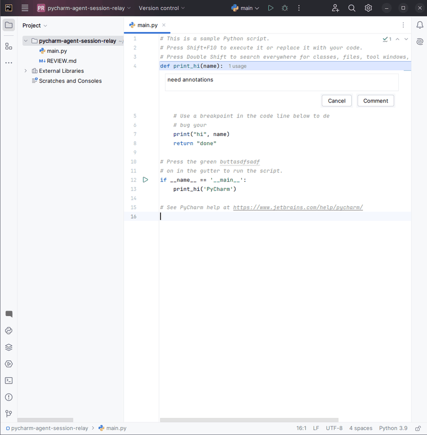

# &nbsp; Agent Session Relay

A JetBrains/PyCharm plugin — **Relay** for short — that lets you review the agent's changes
in your IDE and relay batched, line-anchored comments straight into its running session.

Relay is a **two-way channel** between you and an agent CLI (Claude Code, Codex, or any
agent): the terminal carries **agent → you**, and a batched, line-anchored **review surface**
carries **you → agent** — relayed into the specific session that made the changes.

[](https://plugins.jetbrains.com/plugin/32797-agent-session-relay)
[](https://plugins.jetbrains.com/plugin/32797-agent-session-relay)
[](https://github.com/zerlok/pycharm-agent-session-relay/actions/workflows/ci.yml)
[](LICENSE)



> **Status: MVP implemented.** The full annotate → batch → export → deliver loop works, and the
> batch survives restarts. Typed terminal relay and multi-session/worktree support remain deferred
> follow-ons — see [project context](openspec/project.md) for the current picture.

## Install

**[Agent Session Relay on the JetBrains Marketplace →](https://plugins.jetbrains.com/plugin/32797-agent-session-relay)**

In your IDE: **Settings → Plugins → Marketplace**, search **"Agent Session Relay"**, then **Install**.
Requires a **2024.2 or newer** IntelliJ-based IDE — built for PyCharm Community, runs in any
IntelliJ-based IDE.

## The problem

When an agent edits your files remotely and they sync back locally, PyCharm shows you the
diff — but there's no way to attach several line-anchored comments and return them to the
agent as one reviewable batch. You end up retyping feedback into the terminal, losing the
file/line anchoring the agent could otherwise resolve directly.

## What Relay does

Relay is a **line-anchored annotation layer over any file in the project**, batched and
exported to an agent CLI. The canonical flow:

```
 0. agent edits files  →  they land in your local working tree (synced in, if remote)
 1. Refresh & review  →  VFS refresh so the edits on disk show up
 2. open a file, select lines, leave a comment  (repeat across files)
 3. see / edit / delete pending comments  (inline cards + tool window)
 4. open the tool window, preview the batch, add more
 5. (the agent sits idle, waiting for input)
 6. press Submit  →  Relay writes REVIEW.md at the project root and notifies you to hand it to the agent
```

The export uses Claude Code's native reference syntax (`@path/file.py#L10-15` + comment
body), so the agent resolves anchors directly — no in-file comment markers that would
collide with the agent's own edits under bidirectional sync.

Relay does not emulate a terminal, render diffs, or manage file sync — it reuses PyCharm's for the
first two and reads and writes your *local* working tree only. See
[Scope](openspec/project.md#scope) for where those boundaries come from.

## Development

Kotlin, built with the [IntelliJ Platform Gradle Plugin](https://plugins.jetbrains.com/docs/intellij/tools-intellij-platform-gradle-plugin.html)
against PyCharm Community 2024.2; requires a JDK 21. This is a **spec-driven** repository
([OpenSpec](https://github.com/Fission-AI/OpenSpec)): every feature starts as a change proposal
under `openspec/changes/` before any code.

| You want to know | Read |
|------------------|------|
| What Relay is for, what is in scope, project status, how to build it | [`openspec/project.md`](openspec/project.md) |
| What the product must do for the user | `openspec/specs/<capability>/spec.md` |
| How the code is structured and what rules a change must obey | [`docs/ARCHITECTURE.md`](docs/ARCHITECTURE.md) |
| What a UI element is called and which class owns it | [`docs/UI.md`](docs/UI.md) |
