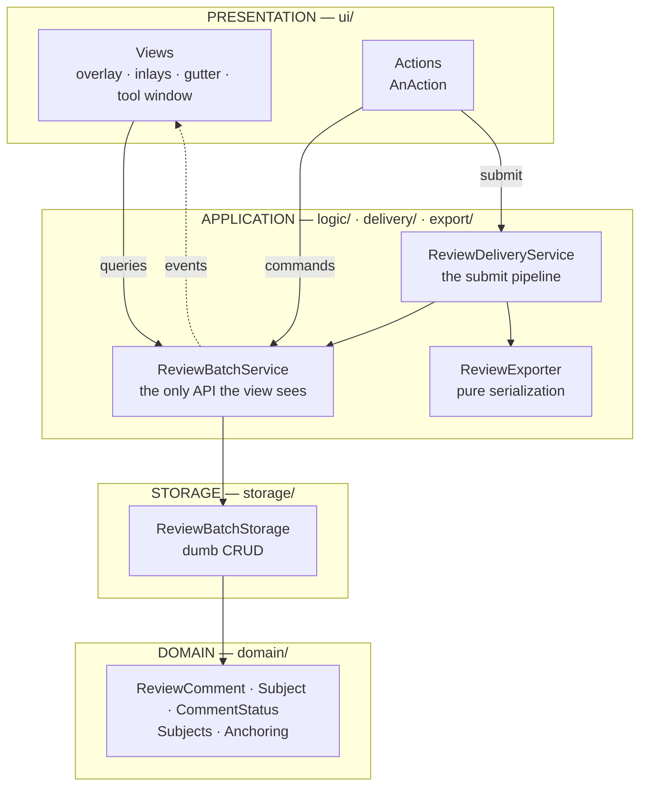
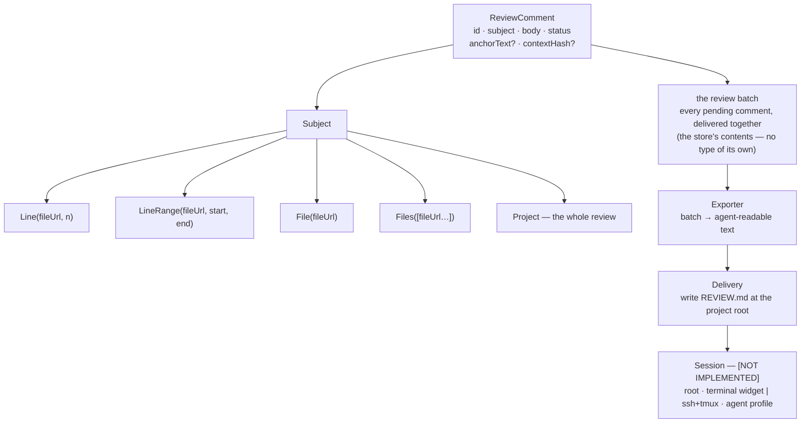
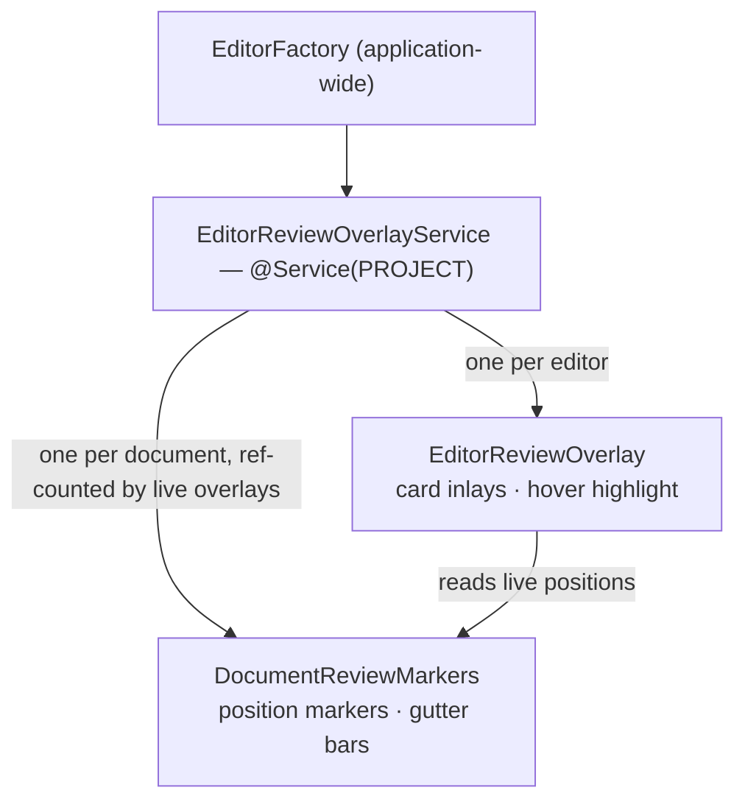
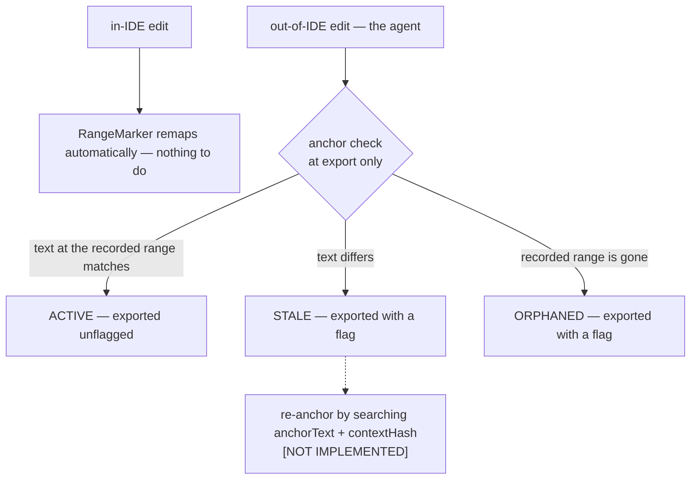
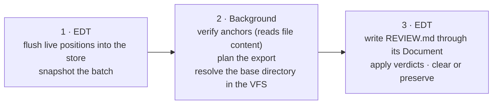

# Architecture

How Relay is built and what rules a change must obey. Its neighbours:

- **What Relay is for, what is in scope, project status** — [`openspec/project.md`](../openspec/project.md).
- **What the product must do for the user** — the capability specs under `openspec/specs/`.
- **What a UI element is called and which class owns it** — [`UI.md`](UI.md).

**Reading rule.** Anything described here that is not built is tagged **[NOT IMPLEMENTED]**.
Untagged prose describes code that exists today, and is read as a guarantee — preserve that
invariant when editing, because a stale untagged claim silently becomes a false one.

Code cites this document by section name (`ARCHITECTURE.md — "Threading"`), never by number, so
sections can be reordered without rotting the references.

---

## Layers

Dependencies point one way: **inward**. The view depends on a logic API and an event topic and
never holds a storage handle; logic mediates every read and write; storage sits behind it and is
swappable without either layer above knowing. The domain is pure Kotlin with no platform imports.

Every layer above the domain depends on it; those edges are left out of the picture to keep the one
that matters — nothing points back up — readable. The single dotted edge is the seam: the view
learns that something changed and re-queries, so it still holds no handle on anything below.

| Layer | Package | What lives there | Platform primitive |
|-------|---------|------------------|--------------------|
| Domain | `domain/` | `ReviewComment`, `Subject`, `CommentStatus`, and the pure projections over them (`Subjects`, `Anchoring`) | — |
| Storage | `storage/` | `ReviewBatchStorage` and its backings | `PersistentStateComponent` |
| Application | `logic/`, `export/`, `delivery/` | `ReviewBatchService` (commands, queries, events), `ReviewDeliveryService` (the submit pipeline), `ReviewExporter` (pure) | `@Service(PROJECT)` |
| Seam | `logic/ReviewBatchListener` | The one channel from application to presentation | `MessageBus` `Topic` |
| Presentation | `ui/` | Actions, per-editor and per-document view objects, tool window, notifications | `AnAction`, `EditorFactoryListener`, `DocumentMarkupModel`, `Inlay`, `GutterIconRenderer`, `ToolWindowFactory` |

Three rules follow from the diagram, and they are the ones to check a change against:

- **Storage is a layer, not a private field of logic.** What it hides — *how* records are held —
  must not leak upward. This is what let the in-memory `Map` become a `PersistentStateComponent`
  in one wiring line, touching neither layer above it.
- **The store is the single source of truth.** No view keeps its own comment list; each seeds from
  `ReviewBatchService.comments()` and re-queries on every event.
- **One documented upward reach.** `ReviewDeliveryService` calls into `EditorReviewOverlayService`
  for live marker positions, which exist nowhere else. Delivery owns *when* the flush happens; the
  view still owns the markers it reads.

## Naming conventions

The suffixes are the layer vocabulary — a name says which layer a class belongs to and what owns
its lifetime.

| Name shape | Means | Examples |
|------------|-------|----------|
| `*Storage` | The storage layer: CRUD over records, no policy | `ReviewBatchStorage`, `PersistentReviewBatchStorage` |
| `Persisted*` | The flat, serializer-friendly DTO of a domain type | `PersistedComment` |
| `*Service` | A project-scoped `@Service` owning one concern's state and lifetime | `ReviewBatchService`, `ReviewDeliveryService`, `EditorReviewOverlayService` |
| `*Listener` | A `MessageBus` topic interface — the subscriber's side of a seam | `ReviewBatchListener`, `CommentEditingListener` |
| `*Action` | An `AnAction` — a user-invoked command, and nothing else | `SubmitReviewAction`, `AddReviewCommentAction` |
| `*Controller` | Owner of transient interactive state, not of persisted state | `CommentDraftController` |
| `*Overlay` | A view object scoped to **one editor** | `EditorReviewOverlay` |
| `*Markers` | A view object scoped to **one document** | `DocumentReviewMarkers` |
| `Relay*` | A name that would be too generic to read in a platform context | `RelayStyle`, `RelayHoverListener` |

Two domain-flavoured names carry a distinction worth keeping straight: a **draft** is a comment
being authored or edited (transient, one at a time), a **card** is a stored comment rendered
read-only. They are the same comment in two states, and deliberately look alike — see
[UI.md](UI.md).

## Domain model

A **comment** is a body plus a **subject** — the thing it is about. The subject is deliberately
open, so a comment is not limited to a single line range.

Delivery stops at the artifact today: it writes `REVIEW.md` and tells the user to hand it to the
agent. **Session — a delivery target Relay can address directly — is [NOT IMPLEMENTED]**; it is in
the picture because it is what the delivery stage's shape is for.

- **Line-anchored subjects** (`Line`, `LineRange`, `File`) carry a file **url** and 0-based line
  numbers — the editor's convention. 1-based line numbers are a display and export concern only.
- `Files` and `Project` need no line anchor, which is why `anchorText` and `contextHash` are
  optional on the record.
- Only `Line` and `LineRange` are authored today; the rest are modeled so that widening the scope
  later is additive rather than a model rewrite. Which subjects the user can actually author is a
  product decision, in the `review-annotation` capability.
- **`CommentStatus`** is where a comment stands relative to the code it anchors to: `ACTIVE`
  (verified, or not checkable), `STALE` (the text under it changed), `ORPHANED` (its range no
  longer exists). See [Positions and anchoring](#positions-and-anchoring).

Three things are first-class seams rather than fixed choices:

| Seam | Why it is pluggable |
|------|---------------------|
| **Exporter** | The export format is agent-specific — Claude reads markdown with `@path#L` refs; others differ. |
| **Session** | Delivery is per-session, and several agents can share one repo through worktrees. |
| **Capture mode** | *How content enters the surface* — any open file (built), the changed-files diff, a plan file. Modes differ solely in how content arrives, never in how a comment is authored, listed, exported, or delivered. |

## Reading the working tree

The "no git" constraint is about *transport between hosts*, not about reading your own working
tree. **Change detection is [NOT IMPLEMENTED]** — comments are authored against any file, any line,
and are not limited to changed lines. When the diff capture mode lands, the change source is
`ChangeListManager` / `LineStatusTracker` (the git working-tree diff), with snapshot-at-launch as
the fallback for non-git projects.

The real subtlety is **VFS lag**: file sync writes to disk, but the IDE's virtual file system may
not have noticed yet, and a review of stale content is worse than no review. Relay therefore offers
an explicit **Refresh & review** action and otherwise relies on the platform's frame-activation
refresh.

## View objects and their lifetimes

Editor rendering is **retained-mode**: register a markup or inlay object once and the platform
repaints it. The view therefore maintains live objects, not frames, and reconciles them **by diff**
on every store event — add new, dispose removed, leave the rest.

**Ownership follows the platform scope of the primitive.** An inlay lives on an editor; document
markup is shared by every split showing that file. So:

- **Filter and seed.** `EditorFactory` is application-wide, so handle only editors whose `project`
  matches, whose `editorKind` is `MAIN_EDITOR`, and whose document has a file. At startup, seed
  from `EditorFactory.getAllEditors()` — `editorCreated` fires only for editors opened afterwards.
- **Parent disposables to the service, never to the editor or project directly**, so they release
  on dynamic plugin unload too; dispose them eagerly in `editorReleased`.
- **Markers are per-document, cards are per-editor.** Otherwise N splits of one file would each add
  their own highlighter for the same comment. A document's markers are built by the first editor to
  show the file and disposed after the last one's close flush.
- **Out of range → orphaned.** A comment whose recorded range does not exist in the current
  document gets no marker and no card, and is marked `ORPHANED`; it keeps its recorded range and
  stays in the tool window. Having no live position at all is what makes it structurally impossible
  for a sync point to write a display-time substitute over what the user recorded. It returns to
  `ACTIVE` at the next reconcile once the range fits again.

## Positions and anchoring

### Inert data, live objects

The store holds **only inert, serializable data**: a file **url** (not a `VirtualFile`), **line
numbers** (not a `RangeMarker`), the body, and the anchoring seeds. Every live platform object —
`Document`, `RangeHighlighter`, `Inlay`, `VirtualFile` — is a per-editor or per-document projection
the view derives from that data and frees when the editor closes.

While a file is open, its `RangeHighlighter` (which *is* a `RangeMarker`) is the **live source of
truth for position**; the stored line numbers are the **last-known anchor**, refreshed from the
live marker only at sync points. Storage stays pure while in-IDE edits still track, with no storage
write per keystroke.

**The sync points are three:** document save, editor close, and export. Save and close are flushed
by `EditorReviewOverlayService`; export flushes in stage 1 of the submit pipeline. All three run
the same flush, so they cannot drift.

### Drift, and what is done about it

**Tier 1 needs no help from Relay**, even when the agent rewrites an *open* file: the platform's
reload-from-disk is diff-based, so `RangeMarker`s remap onto the new text and a comment moves to
the right lines by itself.

**Tier 2 is detection, not relocation.** At the export sync point — and only there; a save is not a
claim about anything — each line-anchored comment's recorded `anchorText` is compared against the
text at its recorded range in the file's **current content**, obtained through `FileDocumentManager`:
the in-memory document when the file is open, loaded from disk when it is not. Reading content
rather than markers is what makes the check cover the case Relay's premise makes common — the agent
edits files the user is not looking at. This is I/O, so it runs off the EDT in the delivery layer.

A comment that genuinely **cannot** be checked keeps its status: no recorded anchor text, or a file
that cannot be resolved or read. "We could not check" must never reach the agent as "we checked and
it moved". A closed file is not one of those cases.

`Subjects.fitsIn` is the **single rule** behind every `ORPHANED` verdict, applied at both sites —
the presentation layer against an open document, the delivery layer against a file's content — so
the two can never disagree. Both go through the same idempotent status command, which publishes
nothing for an unchanged status; that is what stops a reconcile→event→reconcile cascade.

`contextHash` is captured but unread. It is the input to the deferred tier.

**Fuzzy re-anchoring — searching for `anchorText` elsewhere and *moving* the comment — is
[NOT IMPLEMENTED]**, deliberately: it can relocate a comment to a wrong-but-plausible match, which
is precisely the failure mode this tier exists to eliminate. Export is the deliverable, so **loop
discipline** (annotate while the agent is idle → submit before it resumes) is the primary defense
and the anchor check is the safety net.

## Threading

| Work | Runs on | Why |
|------|---------|-----|
| Store mutations, listener callbacks, inlay / gutter / markup mutations | **EDT** | They drive UI and are unsynchronized |
| File content reads, anchor verification, synchronous VFS refresh, external processes | **background** | Illegal on the EDT, and they can block |
| PSI / VFS reads | **read action** | Platform contract |
| Navigation touching PSI or indexes | guarded with `DumbService.runWhenSmart` | Indexes may be unavailable |
| Document / PSI / VFS *edits* | **EDT + `WriteCommandAction`** | Platform contract |

**`WriteCommandAction` is only for Document/PSI/VFS edits.** Adding, deleting or re-anchoring a
comment mutates Relay's *own* state, not a document — do it on the EDT without a write command.

Background code is always handed an **immutable snapshot** of the batch, taken on the EDT. The
submit pipeline hops exactly once for that reason:

**The `REVIEW.md` write sits in stage 3, on the EDT, deliberately.** It goes through the artifact's
`Document` inside a `WriteCommandAction`, because clearing the batch — the user's only copy, with
no undo — may only be authorized by an export the user can *see*. A raw filesystem write goes
behind the platform's Document layer, so an open `REVIEW.md` would keep showing the previous export
while the comments were destroyed on the strength of the write not throwing. What "write off the
EDT" protects — a submit that does not freeze the IDE — is carried by stage 2, which holds the work
that can actually block.

One consequence worth stating: because the verdicts are only *stored* in stage 3, stage 2 plans
from the snapshot with the verdicts applied in memory. `ReviewExporter` stays a pure function of
the batch it is handed, and the store still ends up carrying what was exported.

## Persistence

`PersistentReviewBatchStorage` implements `ReviewBatchStorage` behind the same application API,
stored per-user in `workspace.xml` (`StoragePathMacros.WORKSPACE_FILE`) — these are private,
uncommitted drafts, not a VCS artifact.

- **Serialize a flat DTO, not the domain type.** `xmlb` needs a no-arg constructor and mutable
  (`var`) bean properties, and does not serialize a Kotlin sealed hierarchy — so the domain types
  stay inert and `PersistedComment` (`subjectKind` + url + start/end + body + anchor data) absorbs
  every serialization concession. A degenerate or schema-drifted record falls back safely rather
  than aborting the whole restore.
- **Two platform rules the unit tests cannot reach**, so they are guarded reflectively: storage
  config is read only from `@State` (a class-level `@Storage` alone is inert), and `getState()` runs
  off-EDT unless `getStateRequiresEdt = true` — required here because mutations are EDT-only and
  unsynchronized.
- **Obtain it as a service, never construct it.** `loadState` / `getState` fire only when the
  platform owns the instance. `InMemoryReviewBatchStorage` remains the constructible test backing.
- **Resolve off the load path.** `loadState` runs early, before indexing, and loads raw records
  only: it resolves no url and decides nothing. A restored comment is judged when its file's editor
  opens or at the next submit, whichever comes first.

## Platform API policy

**Reuse.** `@Service` (project-level), `MessageBus` / `Topic`, `EditorFactory` /
`EditorFactoryListener`, `DocumentMarkupModel`, `Disposer`, `Inlay` / `EditorCustomElementRenderer`,
`GutterIconRenderer`, `RangeMarker` / `RangeHighlighter`, `ChangeListManager` / `LineStatusTracker`,
`ToolWindowFactory`, `PersistentStateComponent`, `com.intellij.diff.*`,
`org.jetbrains.plugins.terminal` / `TerminalToolWindowManager`.

`LineMarkerProvider` is pull- and PSI-driven — right for static code markers, *not* for
user-authored mutable comment markers, which ride a `GutterIconRenderer` on the highlighter.

**Do not depend on** the bundled GitHub/GitLab review-thread UI or `com.intellij.collaboration.*`.
The reason is **API stability, not licensing** — the module is Apache-2.0 like the rest of
intellij-community, and its code-review editor package is `@ApiStatus.Experimental`. Relay owns its
comment model rather than binding it to an experimental API it does not control.

**On experimental APIs Relay does use.** `Editor.addComponentInlay` / `ComponentInlayRenderer` /
`ComponentInlayAlignment` are `@ApiStatus.Experimental` in the 2024.2.5 target — the same status as
the package the rule above rejects. The distinction that holds is a different one: they live in the
public `com.intellij.openapi.editor` package, whereas the alternative,
`EditorEmbeddedComponentManager`, lives in `openapi.editor.**impl**` and carries no stability
contract at all. They are also the API the platform's own review-comment inlays are built on, so
they will not be withdrawn without a replacement. Both Relay surfaces reach them through one
construction site each, so a revert stays local.

**This is a rule about taking a dependency, not about reading the code.** The GitHub and GitLab
plugins are the reference implementations of an in-editor review surface, and several things Relay
needs sit in the platform rather than in that module — notably `Editor.addComponentInlay`,
`EditorScrollingPositionKeeper`, `ActiveGutterRenderer` + `reserveLeftFreePaintersAreaWidth`, and
`DocumentTracker` / `LineStatusTrackerBase` for mapping a line across an out-of-IDE rewrite. Using
those is in charter. **Study freely:** the GitHub/GitLab plugins (Apache-2.0), Plannotator.
