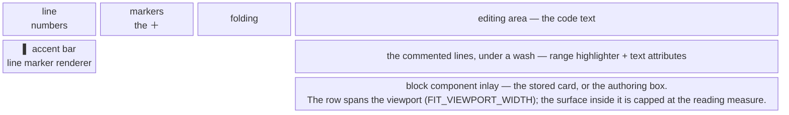

# UI — vocabulary and surfaces

What each thing on screen is called, what platform object it actually is, and which class owns it.
Read this before touching anything under `ui/`.

The layering and lifetime *rules* those classes obey live in
[`ARCHITECTURE.md`](ARCHITECTURE.md); this document is the map from what you see to what it is.

---

## 1. The platform's vocabulary

### The editor and its regions

| Term | What it is | Relay's use of it |
|------|------------|-------------------|
| **Document** | The in-memory text of a file. One per file, **shared** by every editor showing it. | Never stored — the store holds a file url and line numbers. |
| **Editor** (`Editor` / `EditorEx`) | One view over a document. Splitting a file gives two editors over **one** document. | Cards and drafts are per-editor; position markers are per-document. |
| **Editing area** | The region where the code text is drawn (`editor.contentComponent`). `EditorMouseEventArea.EDITING_AREA`. | Where the range wash and the draggable edges are painted. |
| **Gutter** | The strip to the **left** of the code. Not one area but four: `LINE_NUMBERS_AREA`, `LINE_MARKERS_AREA` (icons), `ANNOTATIONS_AREA` (VCS annotate), `FOLDING_OUTLINE_AREA`. "Over the gutter" means *any* area that is not `EDITING_AREA`. | The hover "+" is confined to the gutter and spans all four sub-areas, so moving the pointer onto the icon does not leave the trigger zone. |
| **Right margin** | The thin vertical guide line drawn at the configured column (the hard-wrap guide) **inside** the editing area. | Nothing. It is deliberately *not* a width cap — see [§4](#4-sizing). |
| **Viewport** | The visible window over the editor, inside its scroll pane. Narrower than the editor when scrolled or split. | The width an inline surface is laid out at. |
| **Status component** | A widget handed to the scroll pane via `JBScrollPane.setStatusComponent` that **floats over** the content — in PyCharm, the inspections widget ("no problems found") at the top right. It is not in the viewport's layout. | Reserved against, so a card's trailing icons stay reachable. |
| **Logical vs visual line** | A *logical* line is a line of the document. Soft wrap makes one logical line occupy several **visual** rows. | Every Y coordinate is derived from visual rows; logical math would anchor a wrapped range to its first row only. |

### Marking up text

| Term | What it is | Relay's use of it |
|------|------------|-------------------|
| **Markup model** | The collection of highlighters over a text range. Comes in two scopes: **editor markup** (`editor.markupModel`, that editor only) and **document markup** (`DocumentMarkupModel.forDocument`, shared by every editor on the document). | Transient, view-only highlights go on the editor markup; a stored comment's marker goes on the document markup, so two splits show one bar. |
| **Range highlighter** | A marker over a text range that **is** a `RangeMarker`: it remaps its offsets as the document is edited, so it tracks the code it was placed on. | The live source of truth for a comment's position while its file is open. |
| **Text attributes** | Colors applied to the text in the range — a `backgroundColor` is the familiar "**wash**" behind code. | The commented range's pale blue wash. |
| **Line marker renderer** | Paints in the **gutter** beside the highlighter's lines. The hook VCS change bars use. | The accent bar marking a commented range. |
| **Gutter icon renderer** | An **icon** in the gutter markers column, with a tooltip, a click action and an optional popup menu. | The hover "+". |
| **Custom highlighter renderer** | Paints arbitrary graphics in the **editing area** for that highlighter. | The draggable top and bottom edge strokes of a draft's range. |
| **Highlighter layer** | Paint order (`HighlighterLayer.SELECTION - 1`, `LAST`, …). | Washes sit just under the selection; inert markers sit last. |

### Putting components in the text flow

| Term | What it is | Relay's use of it |
|------|------------|-------------------|
| **Inlay** | Content the editor lays out **inside** the text flow, so it takes real space and pushes code aside. Kinds: *inline* (between characters), *after-line-end*, and **block** (its own row above or below a line). | Both inline surfaces are block inlays below the commented range, so they push following code down rather than floating over it. |
| **Component inlay** | A block inlay hosting a real Swing component, via `Editor.addComponentInlay`. | The authoring box and the stored comment card. |
| **Inlay alignment** | How wide the component's row is. `ComponentInlayAlignment.FIT_VIEWPORT_WIDTH` spans the editor's viewport less its vertical scrollbar, **and re-lays the row out on every visible-area change**. | The whole width mechanism — see [§4](#4-sizing). |
| **Inlay properties** | `relatesToPrecedingText`, `showAbove`, `showWhenFolded`, `priority`. | Both surfaces: relates to preceding text, shown below, visible when folded. |

### Swing and theming

| Term | What it is | Relay's use of it |
|------|------------|-------------------|
| **LaF** | Look and feel — the active theme. Its values change when the user switches theme. | Colors that come from the LaF are read at **build time**, never captured at class-init. |
| **`JBColor(light, dark)`** | A color that resolves per theme. | Every Relay color, all declared in `RelayStyle` and nowhere else. |
| **dp and `JBUI.scale`** | Sizes are written density-independent and scaled to the user's display setting. Constants are named `*_DP`. | Gaps, bar widths, grab zones. |
| **Border, insets, margin** | A Swing component's spacing lives in its **border**; `insets` is how you read it back. This has nothing to do with the editor's *right margin*. | Every horizontal offset in a card or box rides its border, so `insets` is the single place a layout reads one. |
| **Preferred vs minimum size** | The layout asks for *preferred*; *minimum* is a floor. `getMinimumSize` caches from the component's **current** size when none was set. | The inline row returns a zero minimum, or the floor would ratchet up to the widest size the row ever had and it could never shrink again. |
| **Tool window** | A dockable panel (`ToolWindowFactory`). | "Relay Review", anchored bottom. |
| **Notification group / balloon** | Toast notifications, declared in `plugin.xml`. | Comment-added and submit-outcome balloons. |
| **`AnAction`** | A user-invoked command. `getActionUpdateThread` says where `update` may run. | Submit, Refresh & review, Add review comment, Delete, Clear. |
| **`Disposable` / `Disposer`** | Lifetime parenting: disposing a parent disposes its children. | Everything per-editor is parented to a project service, never to the editor or project directly. |

### Relay's own words

| Word | Means |
|------|-------|
| **Surface** | One of the two inline UI objects over code: the authoring **box** or the stored **card**. |
| **Draft** | A comment being authored or edited. At most one exists per project. |
| **Card** | A stored comment rendered read-only under its lines. |
| **Wash** | The pale background over a commented line range. |
| **Gutter bar** | The accent stripe painted in the gutter beside a commented range. |
| **Reading measure** | The comfortable text-column width both surfaces are capped at. |
| **Overlay / markers** | The per-editor and per-document view objects that own those surfaces. |

---

## 2. Anatomy of a commented line

The three cells on the left are gutter sub-areas (`ANNOTATIONS_AREA` sits among them when VCS
annotate is on); everything right of them is the **editing area**. The bottom row is an **inlay**:
it occupies its own row in the text flow, so the code below it moves down — it does not float over
anything.

## 3. Relay's surfaces

| What you see | What it is | Scope | Owned by |
|--------------|-----------|-------|----------|
| **"+" on the hovered gutter line** | `GutterIconRenderer` on a line highlighter in the editor markup | one per project, transient | `RelayHoverListener` (installed by `RelayHoverService`), icon by `AddCommentGutterIconRenderer` |
| **Wash + draggable edges over the range being commented** | Editor-markup `RangeHighlighter`: text attributes for the wash, `CustomHighlighterRenderer` for the edge strokes, `LineMarkerRenderer` for the bar | the open draft | `CommentDraft` |
| **Authoring box** — body field, *Comment* / *Cancel* | Component block inlay under the range's last line, `FIT_VIEWPORT_WIDTH`, content wrapped in `ReadingWidthRow` | one per project | `CommentDraft`, opened through `CommentDraftController` |
| **Stored comment card** — author header, body, *Edit* / *Delete* on hover | Component block inlay, same placement and row as the box | one per comment **per editor** | `StoredCommentCard`, reconciled by `EditorReviewOverlay` |
| **Accent bar beside a commented range, at rest** | `LineMarkerRenderer` on the comment's document-markup highlighter | one per comment **per document** | `DocumentReviewMarkers`, painted by `RangeHighlight.gutterBar` |
| **Wash revealed while hovering a card** | Editor-markup `RangeHighlighter` + the same gutter bar | at most one per editor, transient | `RangeHighlight`, held by `EditorReviewOverlay` |
| **"Relay Review" tool window** — comments grouped by file, plus a toolbar | `ToolWindowFactory` with a `Tree` and an action toolbar | project | `ReviewBatchToolWindowFactory` |
| **Right-click → *Add review comment*** | `AnAction` contributed to `EditorPopupMenu` in `plugin.xml` | — | `AddReviewCommentAction` |
| **Balloons** — comment added, submit outcome | `NotificationGroup` declared in `plugin.xml` | project | `ReviewBatchNotifier`, `SubmitReviewAction` |

Two things about that table are load-bearing:

- **The card and the box are the same object in two states.** They share the fill, the outline, the
  padding, the body font and the row they are laid out in, and the card is suppressed while its box
  is open, so they occupy the same position for the same comment. Any difference between them reads
  as the comment changing identity when the user clicks *Edit*.
- **A commented range wears the accent in exactly one place** — the gutter bar. The card carries no
  accent edge of its own, because two parallel blue lines a few pixels apart read as a stripey
  margin rather than as one object.

`StoredCommentGutterIconRenderer` (a balloon icon with an Edit/Delete popup) exists in the tree but
is **not wired to anything** today; it is kept for the deferred hide-comments change to re-attach.

### Colors and fonts

Every color Relay paints is declared in `RelayStyle` and nowhere else — the surfaces are meant to
read as one object, and when these values lived next to each surface they duplicated and drifted.

| Token | Where it appears |
|-------|------------------|
| `ACCENT` | The gutter bar, a draft's active (hovered or dragged) edge, the frame around the box's body field. Tuned to be visible as a **line**. |
| `ACCENT_FILL` / `ACCENT_FILL_TEXT` | The box's primary button — same hue at the luminance a **filled** shape needs, plus a label color legible on it. |
| `RANGE_WASH` | The pale wash behind text: a draft's live range and the card-hover highlight. Tuned to sit **behind code**, which is why it is not `ACCENT`. |
| `EDGE_IDLE` | A draft's idle range edge — enough above the wash to hint it is grabbable. |
| `surface()` | The fill shared by the card and the box: the platform's UI-surface color, deliberately distinct from the editor's text background so both read as controls floating over code. |
| `bodyFont()` | The body typeface for both surfaces. Set explicitly on each, because a `JBTextArea` inherits a *monospaced* LaF font while an `EditorTextField` carries the UI font — left to inherit, one comment would change typeface the moment it was opened for editing. |

`surface()` and `bodyFont()` are functions, not vals: both are live LaF values that change with the
theme and the IDE font-size setting, so they must be read when a surface is built.

## 4. Sizing

**The platform owns width.** `FIT_VIEWPORT_WIDTH` lays an inlay's row out at the editor's viewport
width less its vertical scrollbar, and re-lays it out on every visible-area and content change. A
split, a window resize or a scrollbar appearing therefore re-wraps a comment body with no listener
of Relay's own.

**Relay owns one number:** the reading measure — 42 characters at the default system font size plus
a 52 dp chrome allowance, the platform's own review-comment figures. It is expressed in **UI-font**
units rather than editor columns, because the body renders in the proportional UI font, which makes
a monospace column count the wrong ruler. Without a cap, a comment on a wide monitor is an
unreadable edge-to-edge stripe.

The editor's **right margin is deliberately not a second cap**: the platform's rule has no such
term, and a margin is editor-column-relative where the reading measure is UI-font-relative.

**The inspections-widget reserve.** The scroll pane's status component floats over the viewport's
trailing edge without being in its layout, so `FIT_VIEWPORT_WIDTH` — which subtracts only the
scrollbar — would lay a surface out underneath it and put the card's *Edit* and *Delete* icons out
of reach. `InlineWidth.overlayInsetPx` measures how much of the viewport it actually covers from
the components' laid-out bounds (the widget partly overhangs the scrollbar, so its own width is not
what it costs), and the reserve is applied unconditionally: the widget is fixed to the top of the
*viewport* while a surface sits in the *document*, so which rows it covers changes on every scroll,
and sizing on that would re-wrap comments as the user scrolled past them.

**Width flows one way, always.** `ReadingWidthRow` reads **its own** width — imposed from above by
the viewport — and lays its single child out at `min(that width − reserve, reading measure)`. No
measure path reads a child's width, so a child's preferred size can never feed back into the width
it is measured at. Two details protect that:

- The row's **minimum size is zero**. Swing caches `getMinimumSize` from the component's current
  size when none was set, so a child-derived floor would ratchet up to the row's widest ever width
  and the surface could never shrink again.
- The child is set **after** the row is constructed, because the child measures its wrapping body
  at the width the row will give it and so has to ask before it exists.

**Height comes from the content**, measured at that pinned width, and the platform reads it to size
the inlay's row. Two consequences worth knowing:

- The box **re-measures on every body edit**, deferred to the EDT queue so the inner editor has
  finished recomputing soft wraps first — that is what makes a long line that merely *wraps* grow
  the box. `revalidate()` is the whole mechanism; calling `Inlay.update` directly would be inert,
  because the renderer reports its component's *current* height.
- The card's **header height is a build-time constant**, captured before the hover actions are
  hidden. Revealing them on hover is then a repaint, not a layout, so the code below never reflows.
