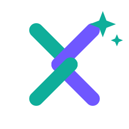

# Relay — brand assets

The Relay logo: the developer's and the agent's **carets woven into one knot**, with an
**AI spark** in the corner — *developer + agent, working as one inside the IDE*.

## Colours

| Role               | Light ground | Dark ground |
|--------------------|--------------|-------------|
| Agent / AI (teal)  | `#0FAE9A`    | `#2BD0BA`   |
| Developer (violet) | `#6F57FF`    | `#8B78FF`   |

## Files

| File | Use |
|------|-----|
| `relay-mark.svg` | primary mark (light grounds) — scalable source |
| `relay-mark-dark.svg` | brightened variant for dark grounds |
| `relay-lockup.svg` | mark + wordmark (outline the text before print) |
| `relay-mark-256.png` | raster mark for the GitHub README (colours read on light & dark) |

**Marketplace icon:** `src/main/resources/META-INF/pluginIcon.svg` + `pluginIcon_dark.svg` (40×40) are
picked up automatically by the JetBrains Platform. It's an SVG — no PNG needed there.

Need another size or a raster lockup? Re-render from the SVGs with any SVG→PNG tool.
