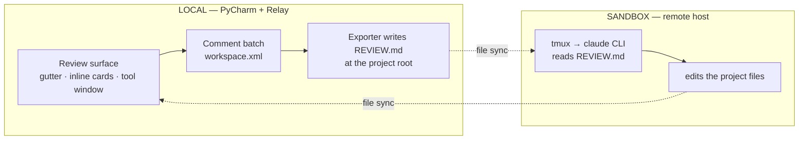

# Agent Session Relay — project context

**Agent Session Relay** (**Relay** for short) is a JetBrains/PyCharm plugin: review an agent's
changes in your IDE and relay batched, line-anchored comments straight into its running session.

A two-way channel between you and an agent CLI — the terminal carries **agent → you**, and a
batched, line-anchored review surface carries **you → agent**, into the specific session that made
the changes.

- **Plugin ID:** `io.github.zerlok.agentsessionrelay` · **License:** MIT
- **Marketplace:** [Agent Session Relay](https://plugins.jetbrains.com/plugin/32797-agent-session-relay) (plugin 32797)

---

## Where to look for what

| You want to know | Read |
|------------------|------|
| What Relay is for, what is in scope, how to build it | **this doc** |
| How to install and use it | [`README.md`](../README.md) |
| What the product must do for the user | `openspec/specs/<capability>/spec.md` |
| What is being built right now | `openspec/changes/` |
| How the code is structured and what rules a change must obey | [`docs/ARCHITECTURE.md`](../docs/ARCHITECTURE.md) |
| What a UI element is called and which class owns it | [`docs/UI.md`](../docs/UI.md) |

Capabilities under `openspec/specs/`: `review-annotation` (author a comment), `review-batch`
(collect and display), `review-export` (serialize for the agent), `review-delivery` (submit),
plus `marketplace-listing` and `release-pipeline`.

---

## Scope

Relay is a **line-anchored annotation layer over any file in the project**, batched and exported to
an agent CLI. That is the core. Everything else is an entry point into, or a transport out of, that
one surface.

Its original value is the combination none of the platform provides: the batched, line-anchored
comment model, the agent-readable export, and delivery to an idle agent.

**Relay does not:**

- **emulate a terminal** — it reuses PyCharm's (`org.jetbrains.plugins.terminal`).
- **render diffs** — it reuses PyCharm's diff viewer / change view.
- **own file sync between hosts** — it reads and writes the **local** filesystem only. A remote
  session is responsible for syncing those files with the local host (e.g. via mutagen). Relay never
  uses git as a cross-host transport. Reading the local working-tree diff for change detection is
  fine; the constraint is only about cross-host commit/push/pull.
- **bundle the IDE's GitHub/GitLab review-thread UI**, or depend on `com.intellij.collaboration.*`.
  It builds its own comment model on editor APIs — see ARCHITECTURE, "Platform API policy".

## The environment it lives in

**Local-only** is the simplest environment: agent and IDE on the same host, no file sync required.
The **remote** picture below is the most complex case; everything Relay does collapses to a subset
of it when the agent is local.



Two consequences shape the design:

- The agent runs **remotely** while the IDE runs **locally**. This is why the official Claude Code
  JetBrains plugin does not fit: it relies on a localhost lockfile/websocket the remote CLI cannot
  reach.
- The terminal tab in PyCharm is *already inside* `claude` (possibly behind ssh and wrappers such as
  tmux). Delivery by typing would type into that same widget — no second remote connection needed.

## Status and deferred scope

The MVP is implemented and published: the full annotate → batch → export → deliver loop works, and
the batch persists across restarts. Submit writes `REVIEW.md` at the project root and notifies the
user to hand it to the agent.

Deferred, in rough order of interest:

| Deferred | Notes |
|----------|-------|
| **Typed terminal delivery** | Type "read REVIEW.md" into the terminal widget already running the agent. Needs a way to target the right widget (the one Relay launched, or the selected one via `TerminalToolWindowManager`), and a mitigation for the sub-second gap between the write and the agent's read. |
| **Capture modes beyond any-file** | The changed-files diff and a plan file as entry points. Only *how content enters the surface* differs; the comment model does not. A Claude plan capture likely uses a `PreToolUse` hook matching `ExitPlanMode` reading `tool_input.plan` — verify the event and payload before specifying it. |
| **Multi-session / worktrees** | One agent per worktree, delivery inferred from the worktree a comment's file lives in, sessions forming a registry. The MVP targets a single project root and does not infer or manage worktrees. |
| **Fuzzy re-anchoring** | Searching for a comment's anchor text elsewhere and *moving* it. Deliberately not built — see ARCHITECTURE, "Positions and anchoring". |
| **Comment scopes beyond line/range** | Whole-file, multi-file and project-wide subjects are modeled but not authored. |

## Working in this repository

**Spec-driven** ([OpenSpec](https://github.com/Fission-AI/OpenSpec)): every feature starts as a
change proposal under `openspec/changes/` before any code, and lands in `openspec/specs/` when
archived.

**Stack:** Kotlin, IntelliJ Platform Plugin Template, Gradle (IntelliJ Platform Gradle Plugin 2.x).
Target IDE is **PyCharm Community 2024.2** (`platformType` / `platformVersion` in
`gradle.properties`); requires JDK 21. It runs in any IntelliJ-based IDE.

```bash
./gradlew compileKotlin  # fastest gate
./gradlew test           # unit tests
./gradlew runIde         # sandbox IDE with the plugin installed
./gradlew buildPlugin    # distribution zip
./gradlew verifyPlugin   # JetBrains plugin verifier
```

The first build downloads the target IDE (~1 GB) into the Gradle cache.
